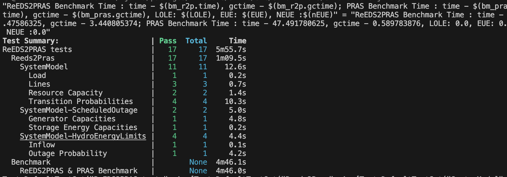

# ReEDS2PRAS

## Introduction

The purpose of ReEDS2PRAS is to translate a ReEDS system into a PRAS system ready for probabilistic resource adequacy analysis.

### Julia Installation

[Juliaup](https://github.com/JuliaLang/juliaup) is a cross platform installer of the Julia programming language.
Detailed instructions to install Julia on different platforms are available from [Juliaup Installation Instructions](https://github.com/JuliaLang/juliaup?tab=readme-ov-file#installation).

#### Mac/Linux

Julia is included in the conda environment, so Julia does not need to be installed separately.
If you wish to install it for testing, you can run:

```shell
curl -fsSL https://install.julialang.org | sh
```

#### Windows

```shell
winget install --name Julia --id 9NJNWW8PVKMN -e -s msstore
```

Then, from the ReEDS-2.0 directory, run `julia --project=. instantiate.jl` to ensure proper installation of Julia and the ReEDS2PRAS environment.

## Basic Usage

If you have a completed ReEDS run and a REPL with ReEDS2PRAS (`using ReEDS2PRAS` after running `add ReEDS2PRAS` in the julia package manager), an example of running ReEDS2PRAS is provided below

```julia
using ReEDS2PRAS

reedscase = "/projects/ntps/llavin/ReEDS-2.0/runs/ntpsrerun_Xlim_DemHi_90by2035EarlyPhaseout__core" # path to completed ReEDS run
solve_year = 2035 #need ReEDS Augur data for the input solve year
weather_year = 2012 # must be 2007-2013 or 2016-2023
timesteps = 8760
user_descriptors = "your_user_descriptors_json_location_here" # Optional - if not passed uses default values

# returns a parameterized PRAS system
pras_system = ReEDS2PRAS.reeds_to_pras(reedscase, solve_year, timesteps, weather_year, user_descriptors = user_descriptors)
```

This will save out a pras system to the variable `pras_system` from the ReEDS2PRAS run. The user can also save a PRAS system to a specific location using `PRAS.savemodel(pras_system, joinpath("MYPATH"*".pras")`. The saved PRAS system may then be read in by other tools like PRAS Analytics (`https://github.nrel.gov/PRAS/PRAS-Analytics`) for further analysis, post-processing, and plotting.

## Multi-year usage

ReEDS2PRAS can be run for multiple weather years of a completed ReEDS run by passing more than 8760 hourly timestamps. For example running all 7 weather years can be accomplished as in the below example

```julia
using ReEDS2PRAS

# path to completed ReEDS run
reedscase = "/projects/ntps/llavin/ReEDS-2.0/runs/ntpsrerun_Xlim_DemHi_90by2035EarlyPhaseout__core"
solve_year = 2035 #need ReEDS Augur data for the input solve year
weather_year = 2007 # must be 2007-2013 or 2016-2023
timesteps = 61320
user_descriptors = "your_user_descriptors_json_location_here" # Optional - if not passed uses default values

# returns a parameterized PRAS system
pras_system = ReEDS2PRAS.reeds_to_pras(reedscase, solve_year, timesteps, weather_year, user_descriptors = user_descriptors)
```

Importantly, the timesteps count from the first hour of the first `weather_year`, so the user must input `2007` as the `weather_year` to run all 61320 hourly timesteps.

## Testing

When CI runners aren't available and ReEDS2PRAS isn't run automatically, it is good practice to run tests and ensure all of them pass before a PR is merged.
It is always good practice to include new tests if the current tests don't cover the functionality you've developed.
You can run ReEDS2PRAS tests by running:

```shell
cd ReEDS-2.0/reeds2pras/test
julia --project runtests.jl
```

or

```shell
cd ReEDS-2.0/reeds2pras/test
julia --project
```

```julia
include("runtests.jl")
```

The tests include PRAS SystemModel building tests and PRAS and ReEDS2PRAS benchmark tests.
If your changes increase the benchmark time by as ignificant amount, that might be worth investigating.

Typical succesful tests summary would look something like this:



## Contributing Guidelines

It is always a good practice to follow the Julia Style Guide (`https://docs.julialang.org/en/v1/manual/style-guide/`).
Please make sure you format your code to follow our guidelines using the snippet below before you open a PR:

```shell
julia -e 'using Pkg; Pkg.add("JuliaFormatter"); using JuliaFormatter; include(".github/workflows/formatter-code.jl")'
```

**NOTE: You have to run the snippet above at the repo folder level.
